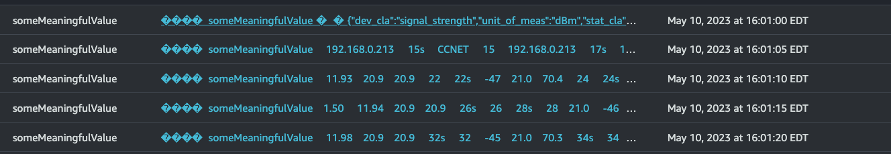

## mqtt-to-kinesis
 
The idea behind  this service is to run it as a container on the edge, subscribe to a topic from MQTT and then batch those payloads up and send them to kinesis data stream --> firehose --> datalake

I have tested this with various free mqtt brokers and it seems to work pretty well.

this service written in Go is deployed via a container using parameterization.
see the Dockerfile.example
  
it can also be ran from command line using an .env file
below is an example of what that file could look like
```console
 PORT=1883
 WEBSOCKET=8080
 BROKER=public.mqtthq.com
 USER=
 PASS=
 CLIENTID=client-123
 TOPIC=homeassistant/sensor/#
 QOS=0
 BACKLOG_COUNT=2000
 KIN_STREAM_NAME=kinesis-data-stream
 KIN_MAXCONN=10
 KIN_SESSION_NAME=mysession-1234
 KIN_PARTITION_KEY=sensor-data
 AWS_ACCESS_KEY_ID=nnnnnnnnnnnnnnnnnnnnn
 AWS_SECRET_ACCESS_KEY=xxxxxxxxxxxxxxxxxxxxxxxxxxxxxxxxxxxxxxxx
 AWS_ASSUME_ROLE_ARN=arn:aws:iam::1111111111111:role/service-role/kinesis-endpoint-access
 AWS_REGION=us-east-1
 STDOUT=true
```

typical STDOUT looks like

```console
key: homeassistant/sensor/eisbar_temperatura_batteria_motore/state
value: 21.1
key: homeassistant/sensor/eisbar_uptime_human_readable/state
value: 42s
key: homeassistant/sensor/eisbar_uptime_sensor/state
value: 42
key: homeassistant/sensor/eisbar_uptime_human_readable/state
value: 42s
key: homeassistant/sensor/eisbar_tensione_batteria_servizi/state
value: 11.98
key: homeassistant/sensor/eisbar_wifi/state
value: -48
key: homeassistant/sensor/eisbar_uptime_human_readable/state
value: 44s
key: homeassistant/sensor/eisbar_uptime_sensor/state
value: 44
key: homeassistant/sensor/eisbar_tensione_pannelli_solari/state
value: 1.50
key: homeassistant/sensor/eisbar_tensione_batteria_motore/state
value: 1.50
key: homeassistant/sensor/eisbar_temperatura/state
value: 21.4
key: homeassistant/sensor/eisbar_umidit/state
value: 68.9
key: homeassistant/sensor/eisbar_uptime_human_readable/state
value: 46s
key: homeassistant/sensor/eisbar_uptime_sensor/state
value: 46
2023/05/11 07:46:19 flushing records reason=interval,  records=1
2023/05/11 07:46:19 Result[0] ShardId=shardId-000000000001,  SequenceNumber=49639767612638592089930656974715882307650445660919955474
```

Kinesis Data Stream view


And you can use AWS Kinesis Firehose to send this to S3 and transform the format if you like
