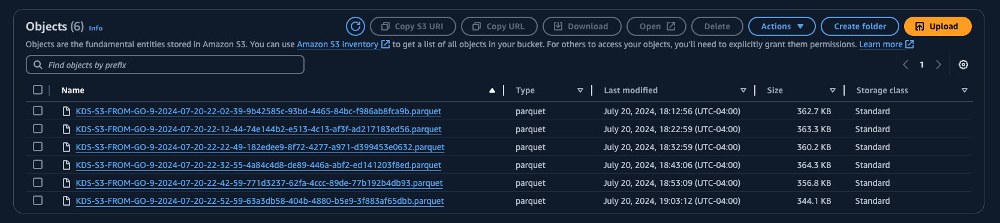
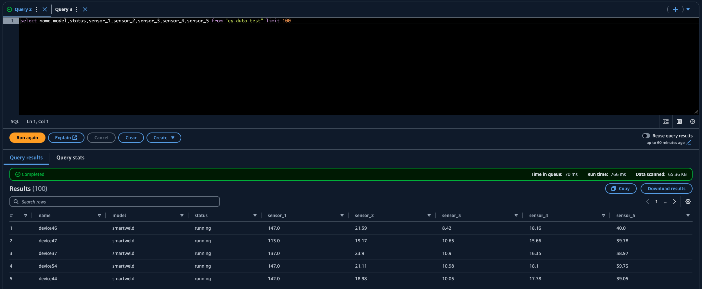

## Streaming MQTT data to Kinesis Data Streams

The idea behind this service is to run it as a container by the dozens at the edge on a kubernetes platform. Through parameterization and CICD, easily deploy containers across dozens of mqtt topics and stream those payloads to kinesis data stream(s) --> firehose --> datalake

I have tested this with EMQX and it works great. In testing with 5,000,000 records, this service uses around 15mb of RAM and 1.5% of CPU. Typical GO efficiency.

Security is simple..
Using IAM, it needs this iam policy attached to the iam 'service user' in order
to send thru the data stream . Just match the Resource property with your KDS Stream ARN

```
{
    "Version": "2012-10-17",
    "Statement": [
        {
            "Effect": "Allow",
            "Action": [
                "kinesis:Get*",
                "kinesis:PutRecords",
                "kinesis:PutRecord",
                "kinesis:DescribeStream"
            ],
            "Resource": "arn:aws:kinesis:us-east-1:123456789012:stream/*"
        }
    ]
}
```

it can also be ran from command line using an .env file
below is an example of what that file could look like

```console
 PORT=1883
 WEBSOCKET=8080
 BROKER=public.mqtthq.com
 USER=
 PASS=
 CLIENTID=client-123
 TOPIC=homeassistant/sensor/#
 QOS=0
 BACKLOG_COUNT=2000
 KIN_STREAM_NAME=kinesis-data-stream
 KIN_MAXCONN=10
 KIN_SESSION_NAME=mysession-1234
 KIN_PARTITION_KEY=sensor-data
 AWS_ACCESS_KEY_ID=nnnnnnnnnnnnnnnnnnnnn
 AWS_SECRET_ACCESS_KEY=xxxxxxxxxxxxxxxxxxxxxxxxxxxxxxxxxxxxxxxx
 AWS_ASSUME_ROLE_ARN=arn:aws:iam::1111111111111:role/service-role/kinesis-endpoint-access
 AWS_REGION=us-east-1
 STDOUT=true
```


S3 Firehose delivery in Parquet format


Once you have this data in S3, you can use a Glue crawler to craw the data, and then use Athena as a SQL workbench to query it...

